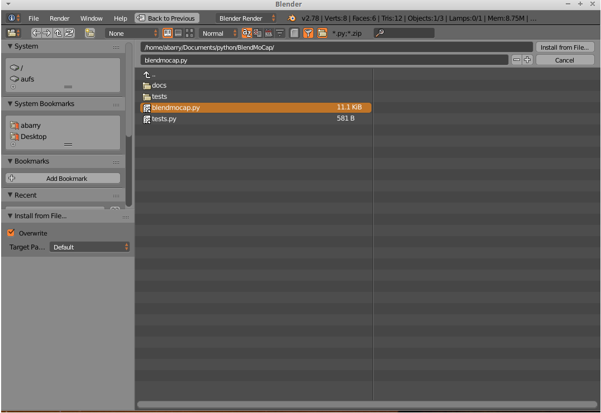
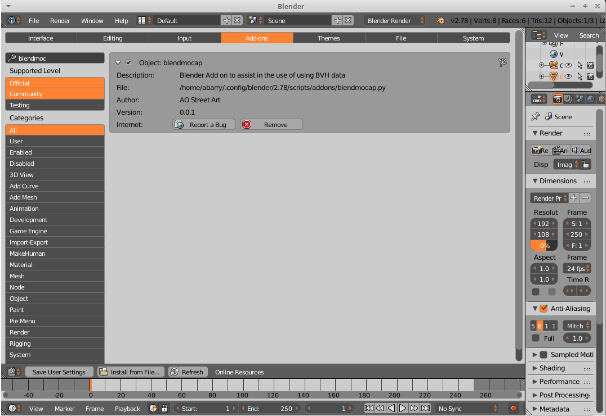

:ref:`Go Home <index>`

Installing BlendMoCap
=====================

Installing BlendMoCap is simple, and starts with cloning the repository:

``git clone https://github.com/AO-StreetArt/BlendMoCap.git``

Blender Installation
--------------------

To install in Blender, open User Preferences->Add-ons, and 'Install from File':

Then, enable the Add-on:

:ref:`Go Home <index>`
